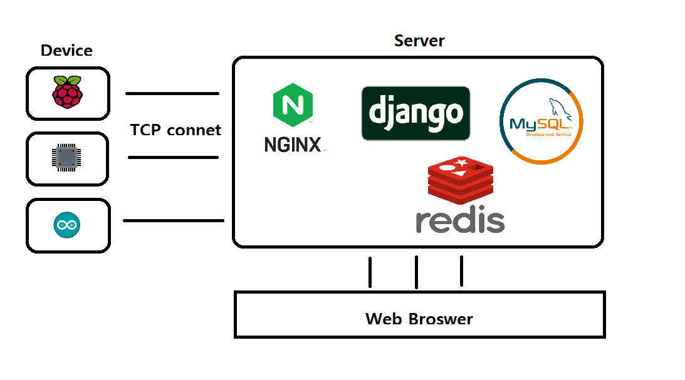

# CapstoneProject2

## 4조원 및 역할
- 김영찬 [32170786] : 웹 백엔드
- 백수연 [] : 웹 프론트
- 신재현 [] : 머신러닝
- 안영훈 [32162534] : 추적 디바이스 관련

## 담당교수님
- 담당교수님 : 최상일 교수님
- 연구실 : 제2공학관 606
- e-mail : choisi@dankook.ac.kr
- 전화번호 : 031-8006-3667

## (GCP) 임시 클라우드 서버
- 외부 고정 IP : 34.64.174.103

## 클라우드 환경
- Ubuntu Linux 20.04 LTS
- Python virtual environment
  - [ ] Python 3.8.10
  - [ ] Django 4.1.1
  * [Reference](https://www.scaleway.com/en/docs/tutorials/django-ubuntu-focal-fossa/)

|  가상환경 켜기 |   source my_env/bin/activate   |
|  가상환경 끄기 |               deactivate            |
 

|    프로젝트 구조도   |
| --------------------------------------- |
|  |

